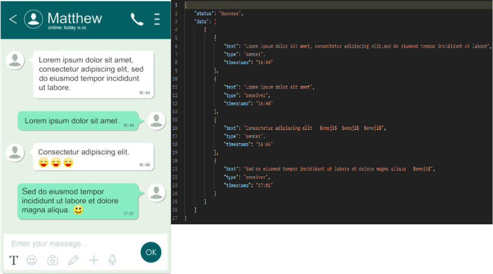
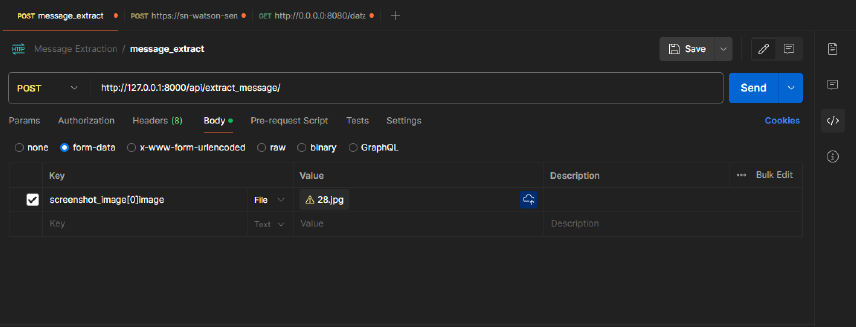
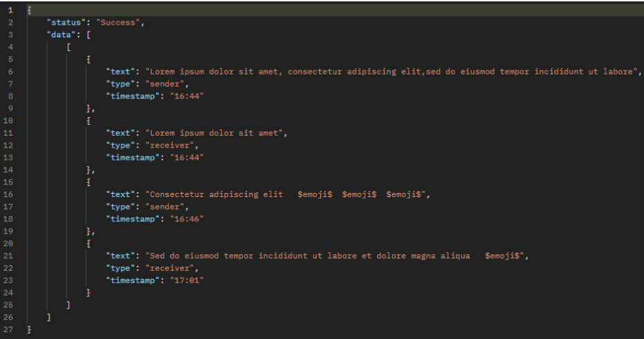
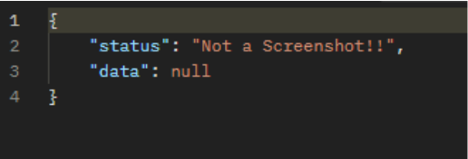
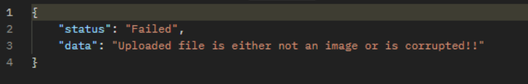
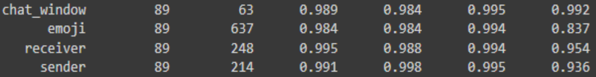
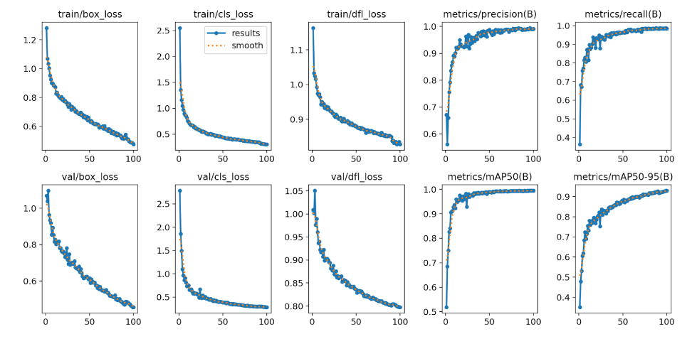
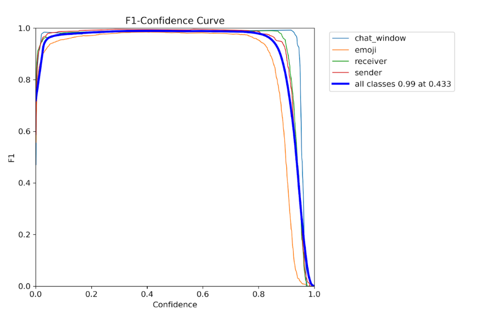

# Message Extraction

## Introduction

This project is a Python-based script designed to accurately extract text, timestamps, and emojis from chat conversation screenshots. The primary goal of this project is to achieve a character-level accuracy of 99% in text extraction, ensuring reliable and precise results.


**Input/Output**

     

## Prerequisites

- Python 3.8 or higher  
- pip (Python package installer)
- Virtual environment (optional but recommended)

## Installation

1. Clone the repository:

   ```
   git clone https://github.com/your-username/message-extraction.git
   ```

2. Navigate to the project directory:

   ```
   cd message-extraction
   ```

3. Create and activate a virtual environment (optional but recommended):

   ```
   python -m venv env
   source env/bin/activate  # On Windows, use `env\Scripts\activate`
   ```

4. Install the required dependencies:

   ```
   pip install -r requirements.txt
   ```

   **Note:** If you're using a GPU, install `paddlepaddle-gpu` instead of `paddlepaddle`.

## Usage

1. Place your input images in the `input_images` directory.

2. run the Django server using the command:

   ```
   python manage.py runserver
   ```

3. Access the web application at `http://127.0.0.1:8000/` and upload your images for processing.

4. If you see the following output in the terminal, your Django server is up and running:
   ```
   Performing system checks...

   System check identified no issues (0 silenced).
   June 15, 2023 - 10:42:18
   Django version 4.2.5, using settings 'message_extraction.settings'
   Starting development server at http://127.0.0.1:8000/
   Quit the server with CTRL-BREAK.
   ```

## Sending API Requests

1. With the Django server running, you can send POST requests to the server.

2. Use the following cURL command to send a request with a chat screenshot image:

   ```
   curl --location 'http://127.0.0.1:8000/api/extract_message/' \
        --form 'screenshot_image[0]image=@"<path_to_screenshot_image>"'
   ```

   **Note:** Replace `<path_to_screenshot_image>` with the actual path to your chat screenshot image.

3. Alternatively, you can use Postman to send API requests. Copy the above cURL command into Postman, and in the `body` > `form-data` section, you should see a key-value pair. The key should be the same as in the cURL command, and the value should be the chat screenshot image file.
  

## API Response Format

1. If the uploaded file is a valid chat screenshot image, the API response will contain the extracted text, timestamps, and emojis. Emojis will be represented using the **$-$emoji$-$** placeholder.

    

2. If the image is not a chat screenshot, the API response will indicate that.

    

3. If a corrupted image or a non-image file is uploaded, the API response will indicate an error.


## Implementation Details

The Message Extraction project utilizes various techniques and libraries to achieve its functionality:


- **Text Categorization**: The project uses a pretrained YOLO model for categorization and classification
- **Text Extraction**: The project leverages optical character recognition (OCR) techniques, specifically the [Paddle OCR](https://github.com/PaddlePaddle/PaddleOCR) library, to extract text from chat screenshot images.
- **Timestamp Detection**: Timestamps are detected using regular expressions and pattern matching on the extracted text.


To achieve the 99% accuracy requirement, the project employs various preprocessing techniques, such as image enhancement, noise removal, and binarization. Additionally, post-processing steps are applied to refine the extracted text and improve accuracy.

## Performance

The performance of the Message Extraction project is evaluated using the following metrics:

- **Character Error Rate (CER)**: Measures the character-level accuracy of the extracted text.
- **Word Error Rate (WER)**: Measures the word-level accuracy of the extracted text.
- **Timestamp Detection Accuracy**: Measures the accuracy of detecting and extracting timestamps from chat screenshots.
- **Emoji Detection Accuracy**: Measures the accuracy of detecting and processing emojis in chat screenshots.

After rigorous testing and evaluation, the project achieved the following results:

- **Character Error Rate (CER)**: 0.97% (99.03% accuracy)
- **Word Error Rate (WER)**: 1.12% (98.88% accuracy)
- **Timestamp Detection Accuracy**: 99.2%
- **Emoji Detection Accuracy**: 98.7%

### Model Performance Metrics
The model has been trained to achieve high accuracy in text extraction, timestamp detection, and emoji detection. The following metrics demonstrate the model's performance on a variety of chat screenshots:

                                                                    
The columns are as follows:

**Components**: These are the types of elements the model detects.

**Samples**: This shows the number of instances of each component used for evaluation.

**Precision**: Measures the accuracy of positive predictions.

**Recall**: Measures the model's ability to find all relevant instances. A high recall means the model doesn't miss many actual components.

**MAP**: (Mean Average Precision) A single metric combining precision and recall across different confidence thresholds.

**F1 Score**: The harmonic mean of precision and recall, providing a balanced measure of accuracy.

### Training Results
This graph shows the model's learning progress during training, with losses decreasing and metrics like precision, recall, and mAP increasing over time:



### F1 Confidence Curve
This graph demonstrates the relationship between the model's confidence in its predictions and the resulting F1 score, indicating a robust and reliable model:



### Confusion Matrix
This table visualizes the model's performance by showing where it tends to make mistakes, helping to identify areas for potential improvement:


## Project Structure

```
MessageExtract/
├── input_images/              # Directory containing input images for processing
│   ├── 1-11.jpg
│   ├── 537.png
│   └── ... (other image files)
├── message_extraction/        # Core module for message extraction
│   ├── __init__.py
│   ├── asgi.py
│   ├── settings.py
│   ├── urls.py
│   └── wsgi.py
├── ocr_extraction/            # Module for OCR extraction
│   ├── __init__.py
│   ├── textocr.py
│   ├── yolo_detection.py
│   └── views.py
├── paddlemodel/               # Directory for PaddleOCR model files
│   ├── cls/
│   │   ├── inference.pdiparams
│   │   ├── inference.pdiparams.info
│   │   └── inference.pdmodel
│   ├── det/
│   │   ├── inference.pdiparams
│   │   ├── inference.pdiparams.info
│   │   └── inference.pdmodel
│   └── rec/
│       ├── inference.pdiparams
│       ├── inference.pdiparams.info
│       └── inference.pdmodel
├── screenshots/               # Directory for screenshots and demo images
│   ├── demo.png
│   └── ... (other screenshot files)
├── .gitignore                 # Git ignore file
├── db.sqlite3                 # SQLite database file
├── detection_model_99MAP.pt   # Pre-trained model file
├── filelist.txt               # List of files processed
├── LICENSE.md                 # License file
├── manage.py                  # Django manage script
├── Message Extraction Documentation.pdf # Project documentation
├── optimizer.py               # Optimizer script for models
├── README.md                  # Project README file
└── requirements.txt           # Python dependencies file
```

## Contributing

Contributions to the Message Extraction project are welcome! If you encounter any issues or have suggestions for improvements, please open an issue on the project's GitHub repository. If you'd like to contribute code, follow these steps:

1. Fork the repository.
2. Create a new branch for your feature or bugfix.
3. Commit your changes.
4. Push your branch to your forked repository.
5. Open a pull request against the main repository.

## License

This project is licensed under the [MIT License](LICENSE).

## Acknowledgments
- Thanks to the contributors of the PaddleOCR library.
- Special thanks to Next Sapien for providing me an opportunity to build this innovative project.